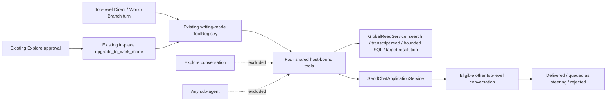

# Extend cross-conversation tools to top-level writing conversations

## Observed journey

A user working in a top-level Direct, Work, or Branch conversation wants the agent to search and read other Phoenix conversations—especially earlier members of its continuation chain—run bounded read-only SQL when needed, and send a message to another eligible conversation. Today those four capabilities are assembled only for the Coordinator, so a coding agent must rely on the user manually carrying context between conversations.

The requested scope is deliberately narrow because a mode-adjacent refactor is upcoming: follow the current writing-mode registry patterns and do not redesign conversation modes or tool registration.

## Verified findings

- `coordinator_tools::tools` currently constructs five global application tools plus optional Coordinator sandboxed Bash: `search_conversations`, `read_conversation`, `query_database`, `resolve_reference`, and `send_conversation_message`.
- The requested writing-conversation set is exactly four existing implementations: `search_conversations`, `read_conversation`, `query_database`, and `send_conversation_message`. `resolve_reference` remains Coordinator-only.
- `RuntimeManager::materialize_runtime` gives top-level Direct/Work/Branch conversations a shared `ToolRegistry::direct(...)` base, while Explore and sub-agent registries use distinct paths. Work/Branch then add the existing writing-mode extensions.
- An approved Explore conversation upgrades to Work in place through `ToolRegistryExecutor::upgrade_to_work_mode`; it does not rematerialize the runtime. Any writing-mode addition must therefore survive that existing registry replacement path.
- All four implementations are already host-bound through `GlobalReadService`; message delivery additionally uses the same `SendChatApplicationService` as the chat endpoint. The SQL boundary is already structurally read-only and resource-bounded in `Database::coordinator_query`.
- Current search excludes the durable Coordinator chain but otherwise uses global retrieval, so it can find the calling conversation's predecessors. Transcript reads are bounded and can address a conversation id, `@conv` reference, or app-local link.
- Current message target resolution rejects sub-agent and Coordinator-chain targets, then delegates acceptance/idempotency/steering behavior to `SendChatApplicationService`. It does not reject a non-Coordinator caller targeting itself.
- `specs/global-recall/requirements.md` currently says ordinary coding conversations must not receive these Phoenix-wide capabilities. The accepted ADR history also describes them as Coordinator capabilities, so the product decision needs a new superseding ADR plus timeless requirement and executive updates rather than silently changing code.

## Inferences and resolved choices

- **Recipients:** top-level Direct, Work, and Branch conversations only. Explore conversations and all sub-agents remain unchanged.
- **Tools:** share the existing four implementations; do not expose `resolve_reference` outside Coordinator.
- **Self-send:** reject it explicitly before calling the chat service, with a stable rejected outcome. Preserve the existing restrictions against sub-agent and Coordinator-chain targets.
- **Security model:** writing conversations intentionally gain the existing operator-level SQL visibility, including sensitive application rows. Do not weaken its SQLite authorizer or budgets and do not introduce a second SQL execution path.

## Interaction map

Persistence, dispatch, steering, runtime materialization, idempotency, and SSE behavior remain owned by the existing chat service and target runtime. Search/read/SQL remain direct bounded reads; no new recovery, polling, or background behavior is introduced.

## Proposed scope

### 1. Share the existing tool implementations without duplicating behavior

- Refactor the current Coordinator tool assembly just enough to expose a reusable factory for the four selected tools.
- Keep `resolve_reference` and explicit-WorkScope sandboxed Bash in the Coordinator-only assembly.
- Generalize user-visible descriptions and logs that incorrectly say the shared send tool can only originate from Coordinator; retain accurate warnings about sensitive SQL output and untrusted stored data.
- Do not rename or redesign the DB/query service solely to remove historical `coordinator_*` internal names; the upcoming mode-adjacent refactor can own broader naming cleanup.

### 2. Extend the current top-level writing registry path

- Construct one shared `GlobalReadService` and `SendChatApplicationService` capability set for ordinary parent runtimes.
- Add the four tools to the existing Direct/Work/Branch parent registry composition in the same straight-line/builder style as current writing-mode additions.
- Preserve those host-bound additions when the existing Explore→Work approval path swaps to a writing registry.
- Do not add the tools to Explore before approval, to fresh or resumed sub-agents, or to the Coordinator's MCP-free registry through a second copy.
- Avoid a new mode enum, policy framework, capability graph, or generalized registry architecture. Make only the minimum threading needed by current materialization and in-place upgrade paths.

### 3. Reject self-targeted cross-conversation messages

- After durable target resolution and before dispatch, compare the resolved target with `ToolContext.conversation_id`.
- Return the existing typed rejected output shape with a stable self-target reason code and do not invoke `SendChatApplicationService`.
- Continue rejecting Coordinator-chain and sub-agent targets and continue using the authoritative chat acceptance path for every other target.
- Generalize origin logging to `origin_conversation_id` without logging message text.

### 4. Update the normative contract

- Update `specs/global-recall/requirements.md` so the timeless capability boundary permits these four tools for top-level writing conversations while retaining the Coordinator's distinct snapshot, reference-resolution, sandboxed Bash, and restricted-registry behavior.
- Add the next project ADR recording the decision to extend bounded global evidence and singular cross-conversation messaging to top-level writing conversations, superseding only the exclusivity portions of the earlier Coordinator decisions.
- Update `specs/adrs/README.md` and the global-recall executive summary/status/verification language so it no longer claims these tools are Coordinator-only.
- Run the `specs/AUTHORING.md` pre-flight checks for touched specs.

## Regression and journey validation

Add focused coverage proving:

1. Top-level Direct, Work, and Branch registries expose exactly the four shared tools.
2. An Explore conversation does not expose them before approval and receives them after the existing in-place upgrade to Work.
3. Explore conversations that remain Explore and all Explore/Work sub-agents do not expose them.
4. Coordinator retains all five application tools plus its optional scoped Bash, with no duplicate registrations.
5. The writing set omits `resolve_reference`.
6. A writing conversation can search/read a predecessor conversation and execute a representative bounded read-only SQL query through the existing implementation.
7. A cross-conversation send still reports delivered/steering/rejected through the shared chat service, while self-send returns the new stable rejection and commits no message or steering entry.
8. Existing Coordinator-chain and sub-agent target rejection remains intact.

Run focused Rust tests followed by `./dev.py check`.

## Acceptance criteria

- A top-level Direct, Work, or Branch agent sees and can invoke `search_conversations`, `read_conversation`, `query_database`, and `send_conversation_message`.
- A newly approved Work conversation gains the same tools without restart or runtime rematerialization.
- Explore conversations and all sub-agents do not gain them.
- `resolve_reference` remains Coordinator-only.
- Search/read/SQL/send behavior is shared with Coordinator rather than forked.
- Self-targeted send attempts are rejected before dispatch with a stable reason code and no durable side effect.
- SQL remains one-statement, read-only, authorizer-enforced, and resource-bounded.
- Normative specs and ADR history accurately describe the expanded boundary.
- `./dev.py check` passes.

## Risks and explicit non-goals

- **Risk — sensitive reads:** `query_database` intentionally exposes operator-level application data to writing agents. Preserve its warning, untrusted-data framing, read-only authority, and all budgets.
- **Risk — registry drift:** initial materialization and Explore→Work replacement are separate paths; tests must cover both.
- **Risk — recursive messaging:** agents can message one another across conversations. This task preserves singular calls and authoritative receiving-state checks; it adds no fan-out, acknowledgement, waiting, or autonomous coordination loop.
- **Non-goal:** expose any tool to Explore mode or sub-agents.
- **Non-goal:** expose `resolve_reference` to writing conversations.
- **Non-goal:** let agents message themselves, Coordinator-chain members, or sub-agents.
- **Non-goal:** alter search ranking, transcript pagination, SQL policy/budgets, durable reference semantics, message acceptance, steering limits, or idempotency.
- **Non-goal:** add automatic predecessor injection, ambient memory, background monitoring, conversation creation, or lifecycle mutation.
- **Non-goal:** perform the upcoming mode/tool-registry refactor or broadly rename historical Coordinator internals.
